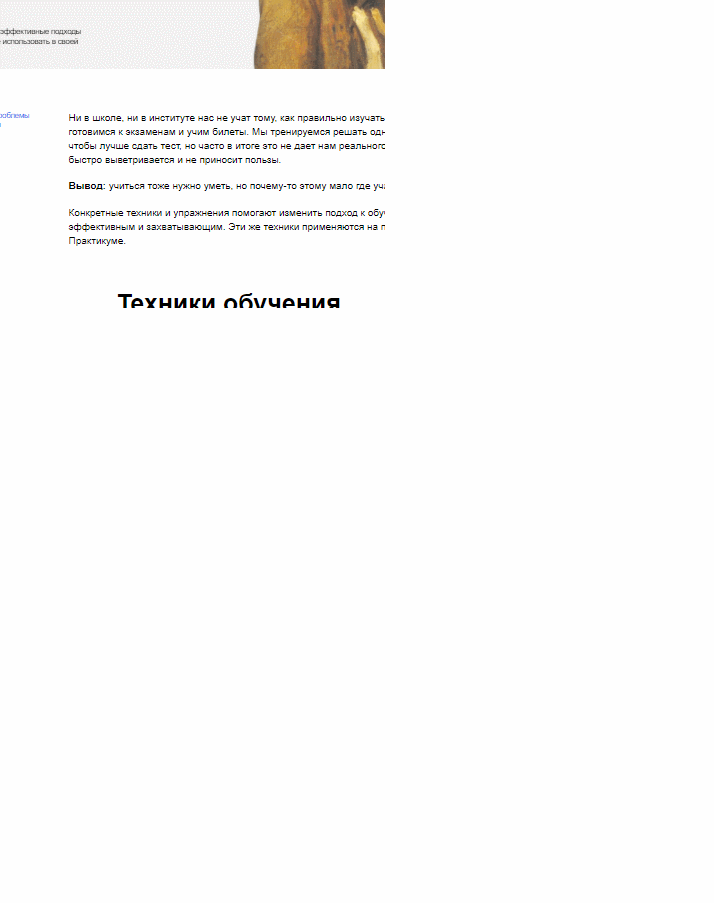

# Учебный проект "НАУЧИТЬСЯ УЧИТЬСЯ"

***
Одностраничный сайт, выполненный с помощью HTML и CSS

***
В проекте используется:
1. БЭМ
2. flex-box
3. анимация
4. организация файлов по Nested

***
### Cсылка на проект:
[https://irinamashkina.github.io/how-to-learn/]
***
